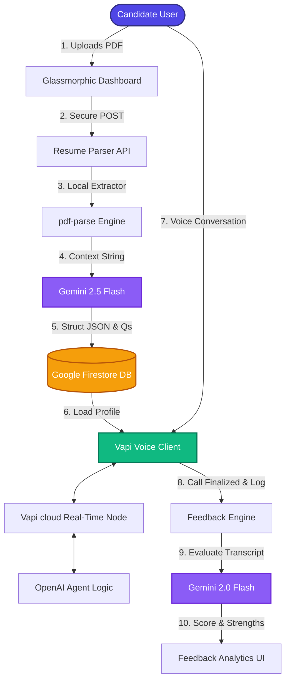

# 🤖 InView.AI — Futuristic RAG Mock Interview & ATS Platform

<div align="center">
  <p align="center">
    <b>Master your next technical interview. Before it even happens.</b>
  </p>
  <p>An ultra-modern SaaS platform built with <b>Next.js 15</b>, powered by <b>Google Gemini 2.5</b> and <b>Vapi Voice AI</b>, featuring real-time conversational mock interviews and comprehensive glassmorphic ATS analytics.</p>

  <a href="https://inview-ai.vercel.app/"><strong>Explore the App »</strong></a>
</div>

---

## ✨ High-End Features

- 🔐 **Enterprise-Grade Auth**: Unified Firebase Client SDK & HTTP-Only Admin session cookies.
- 🎤 **Adaptive Voice Interviews**: Real-time, ultra-low latency vocal conversations driven by Vapi AI & GPT-4.
- 🧠 **Cognitive Question Generation**: Tailored, dynamic technical questioning derived directly from resume architecture parsing.
- 📊 **Glassmorphic ATS Analyzer**: Smart, localized resume keyword scoring, strengths mapping, and automated gap optimization plans.
- 📈 **Analytical Performance Portals**: Dynamic breakdowns evaluating communication clarity, role-fit, and concept mastery.

---

## 🔄 System Workflow & Architecture

Below is the underlying operational data pipeline visualizing how InView.AI processes documents, establishes AI calls, and renders diagnostics:



---

## 🛠️ Modular Tech Stack

| Layer | Technology | Purpose |
| :--- | :--- | :--- |
| **Core Runtime** | **Next.js 15 (Turbopack)** | React Framework, Server Actions & Performance Optimization |
| **Styling** | **TailwindCSS v4 + Framer Motion** | Cinematic, GPU-accelerated layout animations & Dark Mode |
| **AI Engine** | **Google Gemini 2.5 & Vercel AI SDK** | Resume feature extraction, question routing & analysis |
| **Voice Node** | **Vapi Web SDK (Nova-2 / 11Labs)** | Real-time streaming WebRTC conversational voice synthesis |
| **Database** | **Google Firestore** | User documents persistence and interview records archive |
| **Authentication** | **Firebase Native Auth** | Client password logins and server-validated tokens |
| **Parsers** | **PDF-Parse & Mammoth** | In-memory raw PDF/DOCX textual sequence mapping |

---

## 🚀 Deployment & Local Setup

### 1. System Requirements
Verify that you meet the environment prerequisites detailed in [**requirements.txt**](file:///e:/PROJECTS/Rag_Interview_Ai/requirements.txt):
*   Node.js >= 20.0.0
*   NPM >= 10.0.0

### 2. Clone & Initialise
```bash
git clone https://github.com/yourusername/inview_ai.git
cd inview_ai
```

### 3. Install Dependencies
Execute the standard Node package alignment:
```bash
npm install
```

### 4. Set Up Credentials
1.  Copy the secure environment blueprint:
    ```bash
    copy .env.example .env.local
    ```
2.  Configure your secret platform credentials inside [**.env.local**](file:///e:/PROJECTS/Rag_Interview_Ai/.env.local):
    *   `GOOGLE_GENERATIVE_AI_API_KEY` (from Google AI Studio)
    *   `NEXT_PUBLIC_VAPI_WEB_TOKEN` & `NEXT_PUBLIC_VAPI_WORKFLOW_ID` (from Vapi Account)
    *   Firebase Web Configs & Firestore Service Account Keys.

### 5. Fire Up the Dev Engine
```bash
npm run dev
```
The app will spin up instantly on **[http://localhost:3000](http://localhost:3000)**.

---

## ⚡ Terminal Scripts

*   **`npm run dev`**: Boots local Next.js Turbopack development node.
*   **`npm run build`**: Compiles optimized static, typed, and minified server bundle.
*   **`npm run lint`**: Runs Next ES-Lint syntax diagnostic scans.

---

## 🤝 Contributing
Pull requests are highly welcome. For major paradigm or architectural changes, please open a collaborative GitHub issue first to map features before proceeding.

---

## ✍️ Author

**Kartikeya Mishra** — [GitHub](https://github.com/KartikeyaM2007)

---
<div align="center">
  <sub>Developed with ❤️ and state-of-the-art AI Orchestration.</sub>
</div>